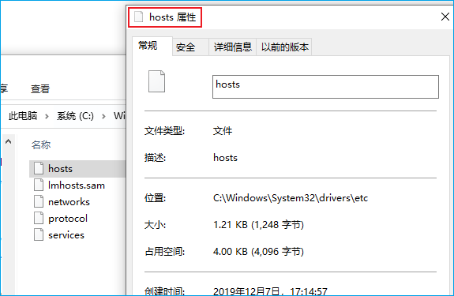
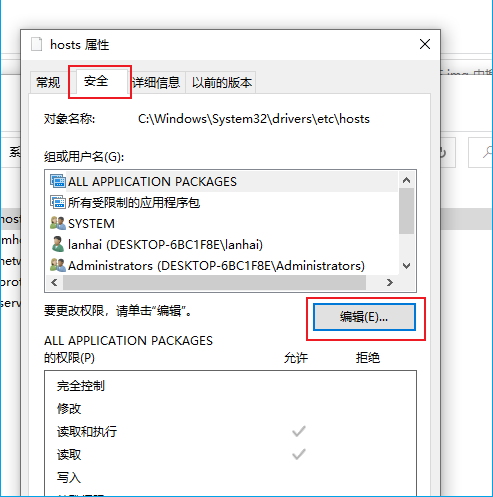
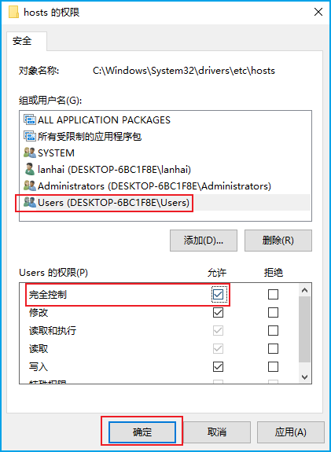

### 无权修改hosts文件解决

+ 当要写入hosts文件时，系统报错"拒绝访问"的错误，按照以下方法给用户授权

---

+ （1）找到hosts文件(一般在[etc目录](C:\Windows\System32\drivers\etc))，**鼠标右键** -> **属性**

+ （2）选择[**安全**] -> 点击[**编辑**]

+ （3）选择当前用户 -> 勾选[**完全控制**] -> 点击[**确认**]进行保存

